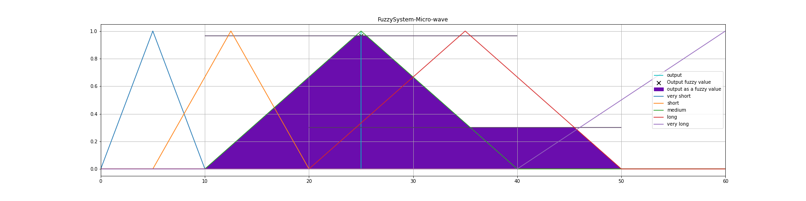

# 2022-NYCU-Fuzzy-System

## Class Notes

[HackMD](https://hackmd.io/rLC9LMnATJKHMG7UsQZQBQ)

## Grading

1. Midterm Exam (40%), but it's free
2. Final Project (60%)

## Final Project

This repository is for the final project of Fuzzy System.

### [Project Description](Fuzzy_system.pdf)

It's based on the paper [A Fuzzy Logic-based Control System for Microwave Ovens](https://iopscience.iop.org/article/10.1088/1742-6596/1577/1/012021/pdf).

And another website called [Artificial Intelligence Using Fuzzy Systems?](https://tealfeed.com/artificial-intelligence-using-fuzzy-systems-am2lq)

### Micro-wave Oven Fuzzy System

* **Input: TypeOfFood, QuantityOfFood**

* Randomly generate the input of the fuzzy system, the number of the data is 1000000.

* **Output: CookingTime**

* Randomly generate the output of the fuzzy system, the number of the data is 1000000.

    <table>
    <tr>
        <th> 
            \
        </th>
        <th>
            TypeOfFood (Fully-cooked)
        </th>
        <th>
            TypeOfFood (Half-cooked)
        </th>
        <th>
            TypeOfFood (Raw)
    </tr>
    <tr>
        <td>
            <strong>QuantityOfFood (Large)</strong>
        </td>
        <td>
            Medium
        </td>
         <td>
            Short
        </td>
         <td>
            Very-Short
        </td>
    </tr>
    <tr>
        <td>
            <strong>QuantityOfFood (Medium)</strong>
        </td>
        <td>
            Long
        </td>
         <td>
            Medium
        </td>
         <td>
            Short
        </td>
    </tr>
    <tr>
        <td>
            <strong>QuantityOfFood (Little)</strong>
        </td>
        <td>
            Very-Long
        </td>
         <td>
            Long
        </td>
         <td>
            Medium
        </td>
    </tr>
    </table>

